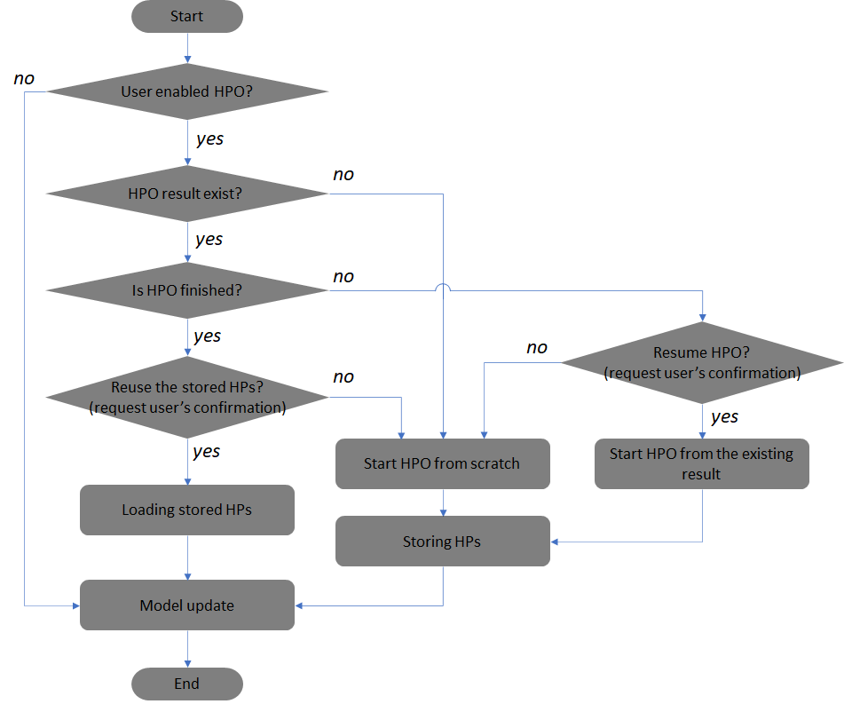

Pause / Resume
=========================

- hpopt supports pause, resume and restart features.

- If there is a completed result, the full fine-tuning can be performed without re-running HPO using the hyper-parameters already found.

- If there are unfinished HPO results, an user can resume HPO from the previous results.

- However, if any configuration of current HPO is different from the previous one, HPO will unconditionally be started over from the beginning.
